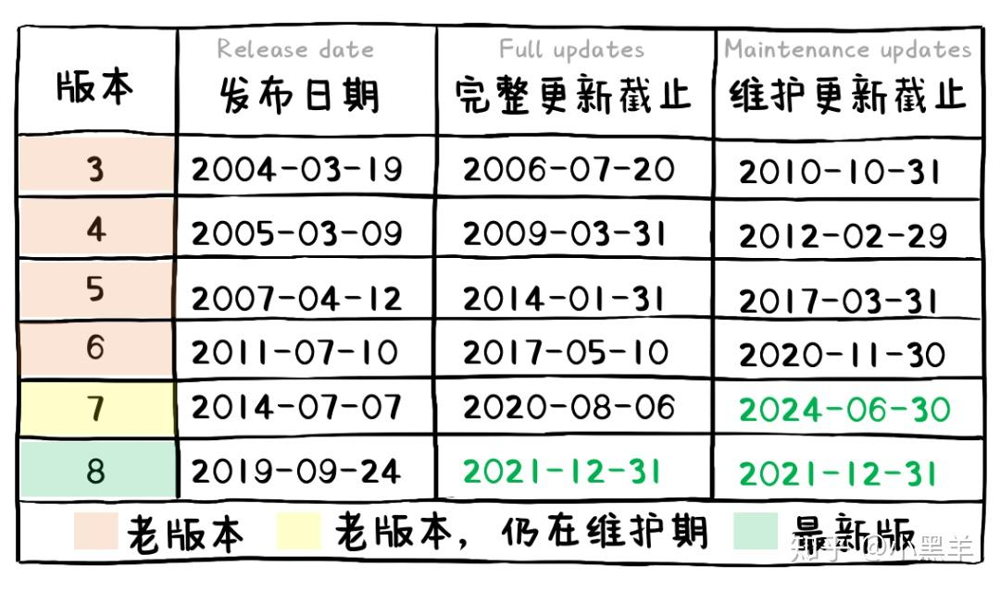

下载VM:
//https://customerconnect.vmware.com/cn/downloads/details?productId=362&downloadGroup=WKST-1001-WIN

下载Centos: https://mirrors.163.com/centos/7.9.2009/isos/x86_64/
        建议选择CentOS-7-x86_64-DVD-2009.iso
        用阿里的镜像下载吧, 上面这个太慢了!!
        https://mirrors.aliyun.com/centos/7/isos/x86_64/

提醒!!!
关于 Centos6
CentOS 6已经随着2020年11月的结束进入了EOL（Reaches End of Life）。所以在2020年12月2日，CentOS官方停止了对CentOS 6的所有更新，并且下架了包括官方所有的CentOS6源，目前阿里、163、清华等CentOS6源已无法使用。

关于Centos后续更新和支持,参见下图

友情提示: 选个Centos 7 吧,,维护更新截止时间晚一点.
            然后为了以防万一,我觉得ubuntu有必要准备一下!!!

环境介绍:
