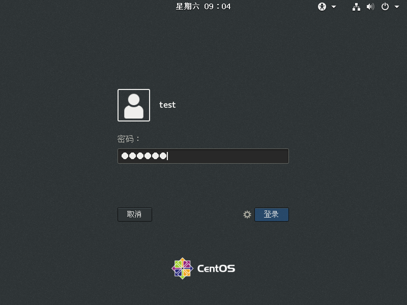

下载VM:
//https://customerconnect.vmware.com/cn/downloads/details?productId=362&downloadGroup=WKST-1001-WIN


下载Centos: https://mirrors.163.com/centos/7.9.2009/isos/x86_64/
        建议选择CentOS-7-x86_64-DVD-2009.iso
        用阿里的镜像下载吧, 上面这个太慢了!!
        https://mirrors.aliyun.com/centos/7/isos/x86_64/

提醒!!!
关于 Centos6
CentOS 6已经随着2020年11月的结束进入了EOL（Reaches End of Life）。所以在2020年12月2日，CentOS官方停止了对CentOS 6的所有更新，并且下架了包括官方所有的CentOS6源，目前阿里、163、清华等CentOS6源已无法使用。

关于Centos后续更新和支持,参见下图


友情提示: 选个Centos 7 吧,,维护更新截止时间晚一点.
            然后为了以防万一,我觉得ubuntu有必要准备一下!!!


环境介绍:

VM Workstations:
VM work station:VMware? Workstation 10.0.7 build-2844087

主机操作系统：
Windows 10 家庭中文版

centos系统:
```
[test@localhost ~]$ cat /proc/version 
Linux version 3.10.0-1160.el7.x86_64 (mockbuild@kbuilder.bsys.centos.org) (gcc version 4.8.5 20150623 (Red Hat 4.8.5-44) (GCC) ) #1 SMP Mon Oct 19 16:18:59 UTC 2020
```

安装centos的一些知识：
记得安装桌面和开发环境， 这样就不用再去配置代码编译和运行的环境了
步骤， 照着下面的来就行
第一步：虚拟机的外部设置


到这里, 外部配置已经结束了, 下一步开启虚拟机, 进行内虚拟机的配置
主要有:
开发环境配置
桌面系统配置
挂载共享文件(方便主机系统和虚拟机之间的文件共享)


开机!!!
等待....


语言选择中文! 选完就继续


软件选装如下


设置root用户密码,创建用户


做完了等待系统安装结束了再重启虚拟机, 之后继续进行共享文件的设置和网络设置!!!


接受许可认证, 设置网络


主机名称设置完记得要应用一下


设置完成了, 可以登录了!!!

输完用户密码就登陆了!!!


然后进行一些引导设置， 位置服务关掉， 邮件服务跳过，语言选择中文，就结束虚拟机设置了！！！


最后进行挂载共享文件设置


最最后！！！验证C语言和C++的编译运行
这个时候， 挂载的共享文件就起作用了， 我们可以在Windows系统上创建、编辑、删除共享文件，然后在Linux虚拟机上编译运行


