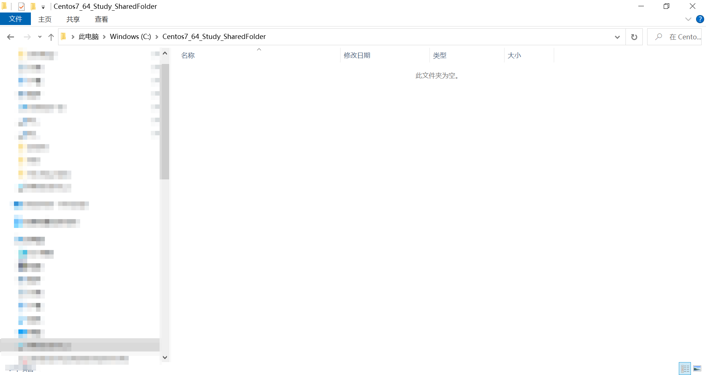
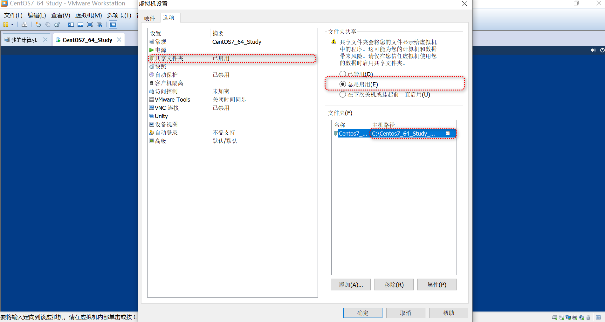

问题背景:
我想在Windows系统上编辑代码文件, 然后再虚拟机上实现编译和运行代码.


环境介绍:
VM Workstations:
VM work station:VMware? Workstation 10.0.7 build-2844087

主机操作系统：
Windows 10 家庭中文版

centos系统:
```
[test@localhost ~]$ cat /proc/version 
Linux version 3.10.0-1160.el7.x86_64 (mockbuild@kbuilder.bsys.centos.org) (gcc version 4.8.5 20150623 (Red Hat 4.8.5-44) (GCC) ) #1 SMP Mon Oct 19 16:18:59 UTC 2020
```
#case 1 共享文件挂载
##Windows系统
创建一个空文件夹C:\Centos7_64_Study_SharedFolder


##VM WorkStations
设置虚拟机的共享文件目录和文件名


##Centos7
```
[test@localhost ~]$ ls -l /mnt/
总用量 0
[test@localhost ~]$ mkdir /mnt/hgfs
mkdir: 无法创建目录"/mnt/hgfs": 权限不够
[test@localhost ~]$ su
密码：
[root@localhost test]# mkdir /mnt/hgfs
[root@localhost ~]# vmhgfs-fuse .host:/ /mnt/hgfs/ -o nonempty -o allow_other
[root@localhost ~]# mount | grep "hgfs"
vmhgfs-fuse on /mnt/hgfs type fuse.vmhgfs-fuse (rw,nosuid,nodev,relatime,user_id=0,group_id=0,allow_other)      //查看挂载的情况, 目前显示挂载已经成功
[root@localhost ~]# ls -l /mnt/hgfs/
总用量 4
drwxrwxrwx. 1 root root 4096 11月 11 11:45 Centos7_64_Study_SharedFolder
[root@localhost ~]# 

```

#case2 取消共享文件挂载
```
[root@localhost ~]# 
[root@localhost ~]# umount /mnt/hgfs/       //这里碰到了一个坑,解决办法看下面的第四节第一小节
umount: /mnt/hgfs：目标忙。
        (有些情况下通过 lsof(8) 或 fuser(1) 可以
         找到有关使用该设备的进程的有用信息)
[root@localhost ~]# 
[root@localhost ~]# kill -9 3920
已杀死
[root@localhost test]# [root@localhost ~]# 

[test@localhost ~]$ su 
密码：
[root@localhost test]# umount /mnt/hgfs     //再次尝试卸载挂载的共享文件

[root@localhost test]# mount | grep "hgfs"      //确认再次卸载成功
[root@localhost test]# 
```

#case3 查看挂载的共享文件
```
[root@localhost ~]# mount | grep "hgfs"
vmhgfs-fuse on /mnt/hgfs type fuse.vmhgfs-fuse (rw,nosuid,nodev,relatime,user_id=0,group_id=0,allow_other)
[root@localhost ~]# \\

```

#case4验证重启是否能自动加载 挂载的共享文件

```
[test@localhost ~]$ ls -l /mnt/hgfs 
ls: 无法访问/mnt/hgfs: 没有那个文件或目录
[test@localhost ~]$ su
密码：
[root@localhost test]# ls -l /mnt/hgfs 
ls: 无法访问/mnt/hgfs: 没有那个文件或目录       //看起来重启后,没有自动加载挂载的共享文件
[root@localhost test]# 

[root@localhost test]# cat /etc/fstab       //修改fstab文件

#
# /etc/fstab
# Created by anaconda on Sat Nov 11 01:31:40 2023
#
# Accessible filesystems, by reference, are maintained under '/dev/disk'
# See man pages fstab(5), findfs(8), mount(8) and/or blkid(8) for more info
#
/dev/mapper/centos-root /                       xfs     defaults        0 0
UUID=2ee5cdb1-7833-44f2-be33-a9621c7265ee /boot                   xfs     defaults        0 0
/dev/mapper/centos-swap swap                    swap    defaults        0 0
.host:/ /mnt/hgfs fuse.vmhgfs-fuse allow_other,defaults 0 0     //增加这一行的内容
[root@localhost test]# mount -a         //前边挂载过了, 先取消一下, 然后再挂载
fuse: bad mount point `/mnt/hgfs': No such file or directory
[root@localhost test]# 

[root@localhost test]# umount /mnt/hgfs 
[root@localhost test]# mount -a
[root@localhost test]# mount | grep "hgfs"      //挂载成功
vmhgfs-fuse on /mnt/hgfs type fuse.vmhgfs-fuse (rw,relatime,user_id=0,group_id=0,allow_other)
[root@localhost test]# 

//reboot 重启一下再看看
[test@localhost ~]$ ls -l /mnt/hgfs/        //完美解决
总用量 4
drwxrwxrwx. 1 root root 4096 11月 11 11:45 Centos7_64_Study_SharedFolder
[test@localhost ~]$ 


```

#case4 坑!
## umount: /mnt/hgfs：目标忙。
```
[root@localhost ~]# 
[root@localhost ~]# 
[root@localhost ~]# umount /mnt/hgfs/       //取消挂载的时候出现目标忙的问题
umount: /mnt/hgfs：目标忙。
        (有些情况下通过 lsof(8) 或 fuser(1) 可以
         找到有关使用该设备的进程的有用信息)
[root@localhost ~]# lsof /mnt/hgfs/
lsof: WARNING: can't stat() fuse.gvfsd-fuse file system /run/user/1000/gvfs
      Output information may be incomplete.
COMMAND  PID USER   FD   TYPE DEVICE SIZE/OFF NODE NAME
bash    3920 test  cwd    DIR   0,39     4096    1 /mnt/hgfs
[root@localhost ~]# 

//解决办法: 直接干掉这个线程吧!, 暂时没找到别的办法
[root@localhost ~]# kill -9 3920
已杀死
[root@localhost test]# 

[root@localhost ~]# kill -9 3920
已杀死
[root@localhost test]# [root@localhost ~]# 

[test@localhost ~]$ su 
密码：
[root@localhost test]# umount /mnt/hgfs     //再次尝试卸载挂载的共享文件

[root@localhost test]# mount | grep "hgfs"      //确认再次卸载成功
[root@localhost test]# 

```

##ls 无法访问挂载的文件/ 挂载失败bad mount point
```
[test@localhost mnt]$ ls -l

ls: 无法访问hgfs: 没有那个文件或目录
总用量 0
d????????? ? ? ? ?            ? hgfs
[test@localhost mnt]$ su
密码：
[root@localhost mnt]# rm -rf hgfs 
rm: 无法删除"hgfs": 是一个目录
[root@localhost mnt]# rm hgfs 
rm: 无法删除"hgfs": 没有那个文件或目录
[root@localhost mnt]# 

[root@localhost mnt]# 
[root@localhost mnt]# vmhgfs-fuse .host:/Centos7_64_Study_SharedFolder /mnt/hgfs -o nonempty -o allow_other
fuse: bad mount point `/mnt/hgfs': No such file or directory
[root@localhost mnt]# 

//这些都是因为已经挂载过了,给他取消掉挂载再重新挂载就行了

```