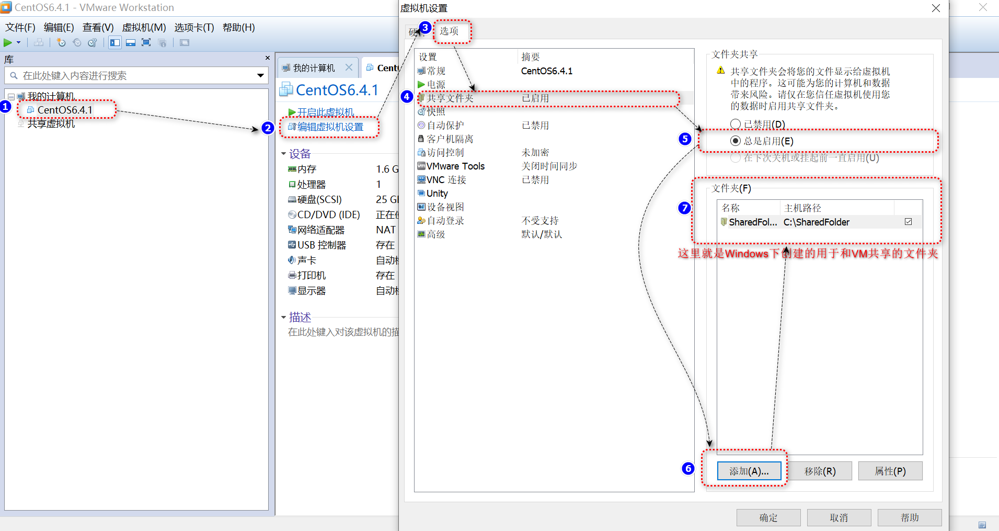

目的:
在开发过程中, 我想使用VM中的Linux的编译和运行环境, 并且使用Windows方便的编辑功能! 那么如何才能实现 VM和Windows之间的文件共享呢?

1. Windows中创建一个文件夹用于和VM共享

2. 修改VM中虚拟机的设置如下图:
    
    参考链接: https://jingyan.baidu.com/article/a501d80c0e13b8ec630f5e04.html#:~:text=%E7%82%B9%E5%87%BB%22%E9%80%89%E9%A1%B9-%E5%85%B1%E4%BA%AB%E6%96%87%E4%BB%B6%E5%A4%B9%22%EF%BC%8C%E9%80%89%E6%8B%A9%E6%80%BB%E6%98%AF%E5%90%AF%E7%94%A8%EF%BC%8C%E7%82%B9%E5%87%BB%E4%B8%8B%E6%96%B9%E9%80%89%E6%8B%A9%E4%B8%8E%E8%99%9A%E6%8B%9F%E6%9C%BA%E5%85%B1%E4%BA%AB%E7%9A%84%E7%A3%81%E7%9B%98%E3%80%82%203%2F4%20%E6%88%96%E8%80%85%E7%82%B9%E5%87%BB%E4%B8%8B%E6%96%B9%E6%B7%BB%E5%8A%A0%EF%BC%8C%E9%80%89%E6%8B%A9%E6%8C%87%E5%AE%9A%E7%9A%84%E6%96%87%E4%BB%B6%E6%88%96%E6%96%87%E4%BB%B6%E5%A4%B9%E3%80%82,%E6%9F%A5%E7%9C%8B%E5%89%A9%E4%BD%991%E5%BC%A0%E5%9B%BE%204%2F4%20%E6%89%93%E5%BC%80%E8%99%9A%E6%8B%9F%E6%9C%BA%EF%BC%8C%E6%89%93%E5%BC%80%E6%88%91%E7%9A%84%E7%94%B5%E8%84%91%E7%82%B9%E5%87%BB%E4%B8%BB%E6%9C%BA%E7%9A%84%E7%A3%81%E7%9B%98%E3%80%82

3.在虚拟机中挂载这个共享文件

    3.1 打开CentOS终端，输入命令，查看共享文件夹情况
        [itcast@localhost ~]$ vmware-hgfsclient 
        SharedFolder
        [itcast@localhost ~]$ 
    
    3.2 创建挂载目录
        [itcast@localhost ~]$ mkdir /mnt/hgfs
        mkdir: 无法创建目录"/mnt/hgfs": 文件已存在
        [itcast@localhost ~]$ ls -l /mnt/
        总用量 5
        dr-xr-xr-x. 1 root root 4192 11月 10 2023 hgfs
        [itcast@localhost ~]$ 

    3.3 挂载共享目录
        [itcast@localhost ~]$ vmhgfs-fuse .host:/SharedFolder /mnt/hgfs
        bash: vmhgfs-fuse: command not found
        [itcast@localhost ~]$ 

        说明:  SharedFolder 是设置的共享目录名称，/mnt/hgfs 是挂载位置。挂载完成之后可以在共享文件夹中添加文件，看看在CentOS中是否显示。

问题总结
1. bash: vmhgfs-fuse: command not found
    尝试重启 

